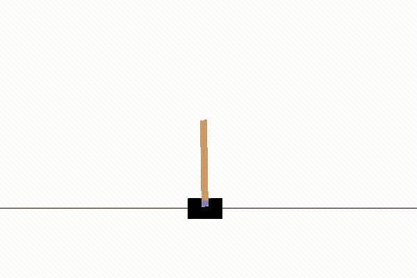

## Reinforcement learning algorithm implementation on Keras
<p float="left">
  
   
</p>

## Background
This is the most understandable implementation of reinforcement learning algorithm for whom learning those algorithm and find difficulty when looking at the papers. Hopefully the code will helps you to understand the algorithm more more efficiently and shorten the learning curve. Comments and explanation are written heavy in the code. And a few successful trainable examples is also provided. 

Further more, rlkeras is works along with OpenAI GYM. Which also allows you to apply the algorithm into your own game.  

## Installation
Download the source
```
git clone https://github.com/will-hcau/rlkeras.git
```
Install the package
```
cd rlkeras
pip install .
```
To uninstall
```
pip uninstall rlkeras
```

## Algorithm Supported

 - Deep Q Network (DQN)
 	- Experience Replay
 	- Target Q
 	- Double Q network
 	- Dueling Q network
 - To be continue...

## Examples
The classic game on OpenAI GYM is available to play around
```
python examples/dqn_cartpole_example.py --mode train
python examples/dqn_cartpole_example.py --mode test
```

## Reference
1. Playing Atari with Deep Reinforcement Learning, Mnih et al., 2013
2. Human-level control through deep reinforcement learning, Mnih et al., 2015
3. Deep Reinforcement Learning with Double Q-learning, van Hasselt et al., 2015
4. Dueling Network Architectures for Deep Reinforcement Learning, Wang et al., 2016
